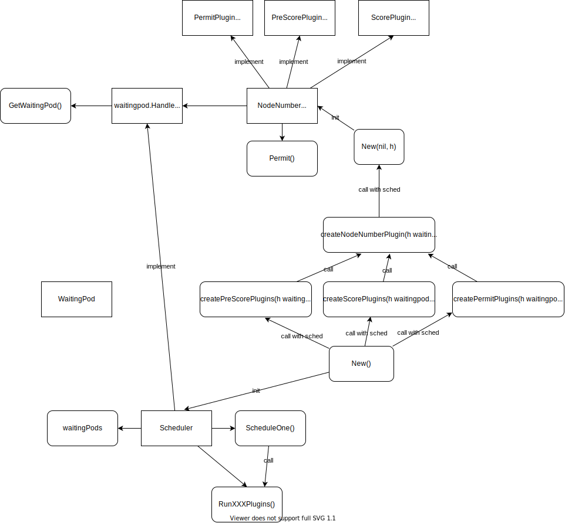

## [5. Permit Plugins](https://github.com/nakamasato/mini-kube-scheduler/tree/05-permit-plugins)

**Permit plugins** are invoked at the end of the scheduling cycle for each Pod, to prevent or delay the binding to the candidate node.

One of three things:
1. approve
1. deny
1. wait

For more details: https://kubernetes.io/docs/concepts/scheduling-eviction/scheduling-framework/#permit

Permit plugins need to implement the `PermitPlugin` interface:

```go
// PermitPlugin is an interface that must be implemented by "Permit" plugins.
// These plugins are called before a pod is bound to a node.
type PermitPlugin interface {
	Plugin
	// Permit is called before binding a pod (and before prebind plugins). Permit
	// plugins are used to prevent or delay the binding of a Pod. A permit plugin
	// must return success or wait with timeout duration, or the pod will be rejected.
	// The pod will also be rejected if the wait timeout or the pod is rejected while
	// waiting. Note that if the plugin returns "wait", the framework will wait only
	// after running the remaining plugins given that no other plugin rejects the pod.
	Permit(ctx context.Context, state *CycleState, p *v1.Pod, nodeName string) (*Status, time.Duration)
}
```

In this example, we'll implement `PermitPlugin` in `NodeNumber` to delay scheduling Pod `<NodeSuffixNumber>` seconds (e.g. `node9` -> 9 seconds).



1. All the `Permit` plugins are registered in `Scheduler.permitPlugins` in `New()` when initalizing `Scheduler`.
1. `ScheduleOne()` is called for a newly created unscheduled Pod.
1. Select a Node in the same way as the previous version of scheduler.
1. `RunPermitPlugins()` is called in `ScheduleOne()`.
    1. `RunPermitPlugins()` calls `Permit()` for each `Permit` plugin.
        1. `WaitingPod.Allow` is called in `NodeNumber.Permit()` after waiting `{nodenum}` seconds.
        1. `Permit()` returns `framework.Wait` status.
        1. For `framework.Wait`, `WaitingPod` is created for the pod and set it to `Scheduler.waitingPods[pod.UID]`
    1. Success signal will be sent to `WaitingPod.s` (channel) in `WaitingPod.Allow`.
    1. `WaitOnPermit` is called in `ScheduleOne()`
    1. In `WaitOnPermit`, the signal is recieved by `waitingPod.GetSignal()`.
    1. After getting the signal, if it's success the Pod is bound to the selected node.

### 5.1. Create `WaitingPod`

[minisched/waitingpod/waitingpod.go](minisched/waitingpod/waitingpod.go)

> waitingPodはwait状態のPodに対して、「どのPluginが何秒までに結果を出すのか」を保持している構造体で、timeoutの管理などもこの構造体が行ってくれています。内部的に結果の送受信を行うchannelを保持しており、waitを返したPermit プラグインはwaitingPodのchannelを通してwaitOnPermitしているBinding Cycleへ結果を送信します。

`WaitingPod` is a struct that stores by when each plugin returns the result for a Pod in the waiting state. Internally it has a channel to send and receive the result, the Permit plugin that returns wait can send the result to Binding Cycle via the WaitingPod's channel.

```go
type WaitingPod struct {
	pod            *v1.Pod
	pendingPlugins map[string]*time.Timer
	s              chan *framework.Status // channel to return the result
	mu             sync.RWMutex
}
```

What `WaitingPod` does:
- When `Allow` is called, the success signal is delivered to unblock schduling the Pod.
    ```go
	select {
	case w.s <- framework.NewStatus(framework.Success, ""):
	default:
	}
    ```

### 5.2 Update `NodeNumber` Plugin.

1. Add member variable `h waitingpod.Handle` to `NodeNumber`.
    ```go
    type NodeNumber struct{
    	h waitingpod.Handle
    }
    ```
1. Add `Permit` function to implement the `PermitPlugin` interface.

    The main logic is to allow pod after {nodenum} seconds.

    ```go
    // Permit delays binding by calling wp.Allow after waiting the number of seconds
    func (pl *NodeNumber) Permit(ctx context.Context, state *framework.CycleState, p *v1.Pod, nodeName string) (*framework.Status, time.Duration) {
        nodeNameLastChar := nodeName[len(nodeName)-1:]

        nodenum, err := strconv.Atoi(nodeNameLastChar)
        if err != nil {
            // return allow(success) even if its suffix is non-number.
            return nil, 0
        }

        // allow pod after {nodenum} seconds
        time.AfterFunc(time.Duration(nodenum)*time.Second, func() {
            wp := pl.h.GetWaitingPod(p.GetUID())
            wp.Allow(pl.Name())
        })

        timeout := time.Duration(10) * time.Second
        return framework.NewStatus(framework.Wait, ""), timeout
    }
    ```

1. Update `New()` to allow to pass `waitingpod.Handle` to `NodeNumber`.

    ```go
    func New(_ runtime.Object, h waitingpod.Handle) (framework.Plugin, error) {
        return &NodeNumber{h: h}, nil
    }
    ```

### 5.2. Add `GetWaitingPod` function to `Scheduler` in [minisched/scheduler.go](minisched/scheduler.go)

`Schduler` implements `waitingpod.Handle`.

1. Implement `GetWaitingPod`
    ```go
    func (sched *Scheduler) GetWaitingPod(uid types.UID) *waitingpod.WaitingPod {
        return sched.waitingPods[uid]
    }
    ```


### 5.3. Add PermitPlugin to Scheduler.

1. Add PermitPlugins to Scheduler.
1. Update the function by passing `h waitingpod.Handle` as an argument.
    ```go
    type Handle interface {
	    // GetWaitingPod returns a waiting pod given its UID.
	    GetWaitingPod(uid types.UID) *WaitingPod
    }
    ```

    Need to implement `GetWaitingPod`

### 5.4. Use PermitPlugin in Scheduler [minisched/scheduler.go](minisched/scheduler.go)

1. Update `SelectOne`.
    ```diff
    -       if err := sched.Bind(ctx, pod, nodeName); err != nil {
    -               klog.Error(err)
    +       status = sched.RunPermitPlugins(ctx, state, pod, nodeName)
    +       if status.Code() != framework.Wait && !status.IsSuccess() {
    +               klog.Error(status.AsError())
                    return
            }

    +       go func() {
    +               ctx := ctx
    +
    +               status := sched.WaitOnPermit(ctx, pod)
    +               if !status.IsSuccess() {
    +                       klog.Error(status.AsError())
    +                       return
    +               }
    +
    +               if err := sched.Bind(ctx, pod, nodeName); err != nil {
    +                       klog.Error(err)
    +                       return
    +               }
    +               klog.Info("minischeduler: Bind Pod successfully")
    +       }()
    ```

1. Add `WaitOnPermit`.

    1. If the pod is not waiting, just return nil.
    1. Wait until a signal is sent from waitigingPod: `s := waitingPod.GetSignal()`

    ```go
    // WaitOnPermit will block, if the pod is a waiting pod, until the waiting pod is rejected or allowed.
    func (sched *Scheduler) WaitOnPermit(ctx context.Context, pod *v1.Pod) *framework.Status {
        waitingPod := sched.waitingPods[pod.UID]
        if waitingPod == nil {
            return nil
        }
        defer delete(sched.waitingPods, pod.UID)

        klog.InfoS("Pod waiting on permit", "pod", klog.KObj(pod))

        s := waitingPod.GetSignal()

        if !s.IsSuccess() {
            if s.IsUnschedulable() {
                klog.InfoS("Pod rejected while waiting on permit", "pod", klog.KObj(pod), "status", s.Message())

                s.SetFailedPlugin(s.FailedPlugin())
                return s
            }

            err := s.AsError()
            klog.ErrorS(err, "Failed waiting on permit for pod", "pod", klog.KObj(pod))
            return framework.AsStatus(fmt.Errorf("waiting on permit for pod: %w", err)).WithFailedPlugin(s.FailedPlugin())
        }
        return nil
    }
    ```


1. Add `RunPermitPlugins`

    1. For all the permitPlugins, run `plugin.Permit(ctx, state, pod, nodeName`.
    1. Process for failure cases.
    1. For waiting status, create `WaitingPod` with timeout (`pluginsWaitTime`) and set it to `waitingPods` with plugin's name as a key.
    1.
    ```go
    func (sched *Scheduler) RunPermitPlugins(ctx context.Context, state *framework.CycleState, pod *v1.Pod, nodeName string) (status *framework.Status) {
        pluginsWaitTime := make(map[string]time.Duration)
        statusCode := framework.Success
        for _, pl := range sched.permitPlugins {
            status, timeout := pl.Permit(ctx, state, pod, nodeName)
            if !status.IsSuccess() {
                // reject
                if status.IsUnschedulable() {
                    klog.InfoS("Pod rejected by permit plugin", "pod", klog.KObj(pod), "plugin", pl.Name(), "status", status.Message())
                    status.SetFailedPlugin(pl.Name())
                    return status
                }

                // wait
                if status.Code() == framework.Wait {
                    pluginsWaitTime[pl.Name()] = timeout
                    statusCode = framework.Wait
                    continue
                }

                // other errors
                err := status.AsError()
                klog.ErrorS(err, "Failed running Permit plugin", "plugin", pl.Name(), "pod", klog.KObj(pod))
                return framework.AsStatus(fmt.Errorf("running Permit plugin %q: %w", pl.Name(), err)).WithFailedPlugin(pl.Name())
            }
        }

        if statusCode == framework.Wait {
            waitingPod := waitingpod.NewWaitingPod(pod, pluginsWaitTime)
            sched.waitingPods[pod.UID] = waitingPod
            msg := fmt.Sprintf("one or more plugins asked to wait and no plugin rejected pod %q", pod.Name)
            klog.InfoS("One or more plugins asked to wait and no plugin rejected pod", "pod", klog.KObj(pod))
            return framework.NewStatus(framework.Wait, msg)
        }

        return nil
    }
    ```

### 5.5. Run

Conditions:
- Nodes:
    - node0~node4: unschedulable
    - node5~node9: schedulable
- FilterPlugin: `NodeName`
- Pods:
    - `pod1`
    - `pod8`
- Expect:
    - `pod1` is assigned to one of node5~node9 randomly. -> schedule after n seconds.
    - `pod8` is assigned to `node8`. -> schedule after 8 seconds

```
make build run
```

Pod1:
1. `PermitPlugins: One or more plugins asked to wait and no plugin rejected pod. pod: default/pod1`
1. `minischeduler: Pod waiting on permit. pod: default/pod1`
1. `minischeduler: Successfully got signal from waitingPod. pod: default/pod1`
1. `scenario: pod1 is bound to node5`

Pod8:
1. `PermitPlugins: One or more plugins asked to wait and no plugin rejected pod. pod: default/pod8`
1. `minischeduler: Pod waiting on permit. pod: default/pod8`
1. `minischeduler: Successfully got signal from waitingPod. pod: default/pod8`
1. `scenario: pod8 is bound to node8`

<details><summary></summary>

```
make build run
go build -o ./bin/sched ./sched.go
./hack/run.sh
Starting etcd instance
etcd --advertise-client-urls http://127.0.0.1:2379 --data-dir /var/folders/5g/vmdg2t1j2011ggd9p983ns6h0000gn/T/tmp.3Iefz4IG --listen-client-urls http://127.0.0.1:2379 --log-level=debug > "/dev/null" 2>/dev/null
Waiting for etcd to come up.
On try 2, etcd: : {"health":"true","reason":""}
{"header":{"cluster_id":"14841639068965178418","member_id":"10276657743932975437","revision":"2","raft_term":"2"}}etcd started
I0327 22:13:58.081729   34823 instance.go:318] Node port range unspecified. Defaulting to 30000-32767.
I0327 22:13:58.096482   34823 instance.go:274] Using reconciler:
I0327 22:13:58.098138   34823 instance.go:382] Could not construct pre-rendered responses for ServiceAccountIssuerDiscovery endpoints. Endpoints will not be enabled. Error: empty issuer URL
W0327 22:13:58.286346   34823 genericapiserver.go:538] Skipping API authentication.k8s.io/v1beta1 because it has no resources.
W0327 22:13:58.287478   34823 genericapiserver.go:538] Skipping API authorization.k8s.io/v1beta1 because it has no resources.
W0327 22:13:58.298261   34823 genericapiserver.go:538] Skipping API certificates.k8s.io/v1beta1 because it has no resources.
W0327 22:13:58.299752   34823 genericapiserver.go:538] Skipping API coordination.k8s.io/v1beta1 because it has no resources.
W0327 22:13:58.305082   34823 genericapiserver.go:538] Skipping API networking.k8s.io/v1beta1 because it has no resources.
W0327 22:13:58.308484   34823 genericapiserver.go:538] Skipping API node.k8s.io/v1alpha1 because it has no resources.
W0327 22:13:58.314531   34823 genericapiserver.go:538] Skipping API rbac.authorization.k8s.io/v1beta1 because it has no resources.
W0327 22:13:58.314550   34823 genericapiserver.go:538] Skipping API rbac.authorization.k8s.io/v1alpha1 because it has no resources.
W0327 22:13:58.316353   34823 genericapiserver.go:538] Skipping API scheduling.k8s.io/v1beta1 because it has no resources.
W0327 22:13:58.316366   34823 genericapiserver.go:538] Skipping API scheduling.k8s.io/v1alpha1 because it has no resources.
W0327 22:13:58.321424   34823 genericapiserver.go:538] Skipping API storage.k8s.io/v1alpha1 because it has no resources.
W0327 22:13:58.329396   34823 genericapiserver.go:538] Skipping API flowcontrol.apiserver.k8s.io/v1alpha1 because it has no resources.
W0327 22:13:58.336280   34823 genericapiserver.go:538] Skipping API apps/v1beta2 because it has no resources.
W0327 22:13:58.336305   34823 genericapiserver.go:538] Skipping API apps/v1beta1 because it has no resources.
W0327 22:13:58.339918   34823 genericapiserver.go:538] Skipping API admissionregistration.k8s.io/v1beta1 because it has no resources.
I0327 22:13:58.411266   34823 apf_controller.go:317] Starting API Priority and Fairness config controller
I0327 22:13:58.411706   34823 cluster_authentication_trust_controller.go:440] Starting cluster_authentication_trust_controller controller
I0327 22:13:58.411732   34823 shared_informer.go:240] Waiting for caches to sync for cluster_authentication_trust_controller
W0327 22:13:58.413105   34823 warnings.go:70] flowcontrol.apiserver.k8s.io/v1beta2 FlowSchema is deprecated in v1.26+, unavailable in v1.29+
W0327 22:13:58.413109   34823 warnings.go:70] flowcontrol.apiserver.k8s.io/v1beta2 PriorityLevelConfiguration is deprecated in v1.26+, unavailable in v1.29+
W0327 22:13:58.413429   34823 warnings.go:70] flowcontrol.apiserver.k8s.io/v1beta2 FlowSchema is deprecated in v1.26+, unavailable in v1.29+
E0327 22:13:58.413562   34823 controller.go:155] Found stale data, removed previous endpoints on kubernetes service, apiserver didn't exit successfully previously
W0327 22:13:58.413976   34823 warnings.go:70] flowcontrol.apiserver.k8s.io/v1beta2 PriorityLevelConfiguration is deprecated in v1.26+, unavailable in v1.29+
W0327 22:13:58.414011   34823 warnings.go:70] flowcontrol.apiserver.k8s.io/v1beta2 FlowSchema is deprecated in v1.26+, unavailable in v1.29+
W0327 22:13:58.416790   34823 warnings.go:70] flowcontrol.apiserver.k8s.io/v1beta2 FlowSchema is deprecated in v1.26+, unavailable in v1.29+
W0327 22:13:58.435635   34823 warnings.go:70] flowcontrol.apiserver.k8s.io/v1beta2 FlowSchema is deprecated in v1.26+, unavailable in v1.29+
W0327 22:13:58.492620   34823 warnings.go:70] flowcontrol.apiserver.k8s.io/v1beta2 FlowSchema is deprecated in v1.26+, unavailable in v1.29+
W0327 22:13:58.493588   34823 warnings.go:70] flowcontrol.apiserver.k8s.io/v1beta2 FlowSchema is deprecated in v1.26+, unavailable in v1.29+
I0327 22:13:58.514363   34823 apf_controller.go:322] Running API Priority and Fairness config worker
I0327 22:13:58.514453   34823 shared_informer.go:247] Caches are synced for cluster_authentication_trust_controller
W0327 22:13:58.514879   34823 warnings.go:70] flowcontrol.apiserver.k8s.io/v1beta2 FlowSchema is deprecated in v1.26+, unavailable in v1.29+
W0327 22:13:58.533657   34823 warnings.go:70] flowcontrol.apiserver.k8s.io/v1beta2 FlowSchema is deprecated in v1.26+, unavailable in v1.29+
W0327 22:13:58.551339   34823 warnings.go:70] flowcontrol.apiserver.k8s.io/v1beta2 FlowSchema is deprecated in v1.26+, unavailable in v1.29+
W0327 22:13:58.551847   34823 warnings.go:70] flowcontrol.apiserver.k8s.io/v1beta2 FlowSchema is deprecated in v1.26+, unavailable in v1.29+
W0327 22:13:58.571645   34823 warnings.go:70] flowcontrol.apiserver.k8s.io/v1beta2 FlowSchema is deprecated in v1.26+, unavailable in v1.29+
W0327 22:13:58.589381   34823 warnings.go:70] flowcontrol.apiserver.k8s.io/v1beta2 FlowSchema is deprecated in v1.26+, unavailable in v1.29+
W0327 22:13:58.589669   34823 warnings.go:70] flowcontrol.apiserver.k8s.io/v1beta2 FlowSchema is deprecated in v1.26+, unavailable in v1.29+
W0327 22:13:58.591419   34823 warnings.go:70] flowcontrol.apiserver.k8s.io/v1beta2 FlowSchema is deprecated in v1.26+, unavailable in v1.29+
W0327 22:13:58.660887   34823 warnings.go:70] flowcontrol.apiserver.k8s.io/v1beta2 FlowSchema is deprecated in v1.26+, unavailable in v1.29+
W0327 22:13:58.660976   34823 warnings.go:70] flowcontrol.apiserver.k8s.io/v1beta2 FlowSchema is deprecated in v1.26+, unavailable in v1.29+
W0327 22:13:58.663300   34823 warnings.go:70] flowcontrol.apiserver.k8s.io/v1beta2 FlowSchema is deprecated in v1.26+, unavailable in v1.29+
W0327 22:13:58.682587   34823 warnings.go:70] flowcontrol.apiserver.k8s.io/v1beta2 FlowSchema is deprecated in v1.26+, unavailable in v1.29+
W0327 22:13:58.682671   34823 warnings.go:70] flowcontrol.apiserver.k8s.io/v1beta2 FlowSchema is deprecated in v1.26+, unavailable in v1.29+
W0327 22:13:58.700847   34823 warnings.go:70] flowcontrol.apiserver.k8s.io/v1beta2 FlowSchema is deprecated in v1.26+, unavailable in v1.29+
W0327 22:13:58.701015   34823 warnings.go:70] flowcontrol.apiserver.k8s.io/v1beta2 FlowSchema is deprecated in v1.26+, unavailable in v1.29+
W0327 22:13:58.720267   34823 warnings.go:70] flowcontrol.apiserver.k8s.io/v1beta2 FlowSchema is deprecated in v1.26+, unavailable in v1.29+
W0327 22:13:58.720625   34823 warnings.go:70] flowcontrol.apiserver.k8s.io/v1beta2 FlowSchema is deprecated in v1.26+, unavailable in v1.29+
W0327 22:13:58.743624   34823 warnings.go:70] flowcontrol.apiserver.k8s.io/v1beta2 FlowSchema is deprecated in v1.26+, unavailable in v1.29+
W0327 22:13:58.743832   34823 warnings.go:70] flowcontrol.apiserver.k8s.io/v1beta2 FlowSchema is deprecated in v1.26+, unavailable in v1.29+
W0327 22:13:58.819385   34823 warnings.go:70] flowcontrol.apiserver.k8s.io/v1beta2 FlowSchema is deprecated in v1.26+, unavailable in v1.29+
W0327 22:13:58.819642   34823 warnings.go:70] flowcontrol.apiserver.k8s.io/v1beta2 FlowSchema is deprecated in v1.26+, unavailable in v1.29+
W0327 22:13:58.821379   34823 warnings.go:70] flowcontrol.apiserver.k8s.io/v1beta2 FlowSchema is deprecated in v1.26+, unavailable in v1.29+
W0327 22:13:58.839458   34823 warnings.go:70] flowcontrol.apiserver.k8s.io/v1beta2 FlowSchema is deprecated in v1.26+, unavailable in v1.29+
W0327 22:13:58.839708   34823 warnings.go:70] flowcontrol.apiserver.k8s.io/v1beta2 FlowSchema is deprecated in v1.26+, unavailable in v1.29+
W0327 22:13:58.841345   34823 warnings.go:70] flowcontrol.apiserver.k8s.io/v1beta2 FlowSchema is deprecated in v1.26+, unavailable in v1.29+
W0327 22:13:58.859626   34823 warnings.go:70] flowcontrol.apiserver.k8s.io/v1beta2 PriorityLevelConfiguration is deprecated in v1.26+, unavailable in v1.29+
W0327 22:13:58.859746   34823 warnings.go:70] flowcontrol.apiserver.k8s.io/v1beta2 FlowSchema is deprecated in v1.26+, unavailable in v1.29+
W0327 22:13:58.879723   34823 warnings.go:70] flowcontrol.apiserver.k8s.io/v1beta2 PriorityLevelConfiguration is deprecated in v1.26+, unavailable in v1.29+
W0327 22:13:58.879832   34823 warnings.go:70] flowcontrol.apiserver.k8s.io/v1beta2 FlowSchema is deprecated in v1.26+, unavailable in v1.29+
W0327 22:13:58.899218   34823 warnings.go:70] flowcontrol.apiserver.k8s.io/v1beta2 PriorityLevelConfiguration is deprecated in v1.26+, unavailable in v1.29+
W0327 22:13:58.899561   34823 warnings.go:70] flowcontrol.apiserver.k8s.io/v1beta2 FlowSchema is deprecated in v1.26+, unavailable in v1.29+
W0327 22:13:58.917541   34823 warnings.go:70] flowcontrol.apiserver.k8s.io/v1beta2 PriorityLevelConfiguration is deprecated in v1.26+, unavailable in v1.29+
W0327 22:13:58.917688   34823 warnings.go:70] flowcontrol.apiserver.k8s.io/v1beta2 FlowSchema is deprecated in v1.26+, unavailable in v1.29+
W0327 22:13:59.009740   34823 warnings.go:70] flowcontrol.apiserver.k8s.io/v1beta2 PriorityLevelConfiguration is deprecated in v1.26+, unavailable in v1.29+
W0327 22:13:59.009983   34823 warnings.go:70] flowcontrol.apiserver.k8s.io/v1beta2 FlowSchema is deprecated in v1.26+, unavailable in v1.29+
W0327 22:13:59.011569   34823 warnings.go:70] flowcontrol.apiserver.k8s.io/v1beta2 PriorityLevelConfiguration is deprecated in v1.26+, unavailable in v1.29+
W0327 22:13:59.031402   34823 warnings.go:70] flowcontrol.apiserver.k8s.io/v1beta2 PriorityLevelConfiguration is deprecated in v1.26+, unavailable in v1.29+
W0327 22:13:59.031595   34823 warnings.go:70] flowcontrol.apiserver.k8s.io/v1beta2 FlowSchema is deprecated in v1.26+, unavailable in v1.29+
W0327 22:13:59.049646   34823 warnings.go:70] flowcontrol.apiserver.k8s.io/v1beta2 FlowSchema is deprecated in v1.26+, unavailable in v1.29+
W0327 22:13:59.049645   34823 warnings.go:70] flowcontrol.apiserver.k8s.io/v1beta2 PriorityLevelConfiguration is deprecated in v1.26+, unavailable in v1.29+
W0327 22:13:59.069291   34823 warnings.go:70] flowcontrol.apiserver.k8s.io/v1beta2 PriorityLevelConfiguration is deprecated in v1.26+, unavailable in v1.29+
W0327 22:13:59.069552   34823 warnings.go:70] flowcontrol.apiserver.k8s.io/v1beta2 FlowSchema is deprecated in v1.26+, unavailable in v1.29+
W0327 22:13:59.071135   34823 warnings.go:70] flowcontrol.apiserver.k8s.io/v1beta2 PriorityLevelConfiguration is deprecated in v1.26+, unavailable in v1.29+
W0327 22:13:59.089402   34823 warnings.go:70] flowcontrol.apiserver.k8s.io/v1beta2 PriorityLevelConfiguration is deprecated in v1.26+, unavailable in v1.29+
W0327 22:13:59.089573   34823 warnings.go:70] flowcontrol.apiserver.k8s.io/v1beta2 FlowSchema is deprecated in v1.26+, unavailable in v1.29+
W0327 22:13:59.110074   34823 warnings.go:70] flowcontrol.apiserver.k8s.io/v1beta2 PriorityLevelConfiguration is deprecated in v1.26+, unavailable in v1.29+
W0327 22:13:59.110292   34823 warnings.go:70] flowcontrol.apiserver.k8s.io/v1beta2 FlowSchema is deprecated in v1.26+, unavailable in v1.29+
W0327 22:13:59.192450   34823 warnings.go:70] flowcontrol.apiserver.k8s.io/v1beta2 FlowSchema is deprecated in v1.26+, unavailable in v1.29+
W0327 22:13:59.192915   34823 warnings.go:70] flowcontrol.apiserver.k8s.io/v1beta2 FlowSchema is deprecated in v1.26+, unavailable in v1.29+
W0327 22:13:59.194777   34823 warnings.go:70] flowcontrol.apiserver.k8s.io/v1beta2 FlowSchema is deprecated in v1.26+, unavailable in v1.29+
W0327 22:13:59.197202   34823 warnings.go:70] flowcontrol.apiserver.k8s.io/v1beta2 FlowSchema is deprecated in v1.26+, unavailable in v1.29+
W0327 22:13:59.197960   34823 warnings.go:70] flowcontrol.apiserver.k8s.io/v1beta2 FlowSchema is deprecated in v1.26+, unavailable in v1.29+
W0327 22:13:59.218711   34823 warnings.go:70] flowcontrol.apiserver.k8s.io/v1beta2 FlowSchema is deprecated in v1.26+, unavailable in v1.29+
W0327 22:13:59.219247   34823 warnings.go:70] flowcontrol.apiserver.k8s.io/v1beta2 FlowSchema is deprecated in v1.26+, unavailable in v1.29+
W0327 22:13:59.237300   34823 warnings.go:70] flowcontrol.apiserver.k8s.io/v1beta2 PriorityLevelConfiguration is deprecated in v1.26+, unavailable in v1.29+
W0327 22:13:59.237494   34823 warnings.go:70] flowcontrol.apiserver.k8s.io/v1beta2 FlowSchema is deprecated in v1.26+, unavailable in v1.29+
W0327 22:13:59.255759   34823 warnings.go:70] flowcontrol.apiserver.k8s.io/v1beta2 PriorityLevelConfiguration is deprecated in v1.26+, unavailable in v1.29+
W0327 22:13:59.255866   34823 warnings.go:70] flowcontrol.apiserver.k8s.io/v1beta2 FlowSchema is deprecated in v1.26+, unavailable in v1.29+
W0327 22:13:59.275250   34823 warnings.go:70] flowcontrol.apiserver.k8s.io/v1beta2 PriorityLevelConfiguration is deprecated in v1.26+, unavailable in v1.29+
W0327 22:13:59.275698   34823 warnings.go:70] flowcontrol.apiserver.k8s.io/v1beta2 FlowSchema is deprecated in v1.26+, unavailable in v1.29+
W0327 22:13:59.353003   34823 warnings.go:70] flowcontrol.apiserver.k8s.io/v1beta2 PriorityLevelConfiguration is deprecated in v1.26+, unavailable in v1.29+
W0327 22:13:59.356377   34823 warnings.go:70] flowcontrol.apiserver.k8s.io/v1beta2 FlowSchema is deprecated in v1.26+, unavailable in v1.29+
W0327 22:13:59.356559   34823 warnings.go:70] flowcontrol.apiserver.k8s.io/v1beta2 FlowSchema is deprecated in v1.26+, unavailable in v1.29+
W0327 22:13:59.375526   34823 warnings.go:70] flowcontrol.apiserver.k8s.io/v1beta2 FlowSchema is deprecated in v1.26+, unavailable in v1.29+
W0327 22:13:59.375897   34823 warnings.go:70] flowcontrol.apiserver.k8s.io/v1beta2 PriorityLevelConfiguration is deprecated in v1.26+, unavailable in v1.29+
W0327 22:13:59.394582   34823 warnings.go:70] flowcontrol.apiserver.k8s.io/v1beta2 FlowSchema is deprecated in v1.26+, unavailable in v1.29+
W0327 22:13:59.394683   34823 warnings.go:70] flowcontrol.apiserver.k8s.io/v1beta2 FlowSchema is deprecated in v1.26+, unavailable in v1.29+
W0327 22:13:59.396135   34823 warnings.go:70] flowcontrol.apiserver.k8s.io/v1beta2 FlowSchema is deprecated in v1.26+, unavailable in v1.29+
W0327 22:13:59.397440   34823 warnings.go:70] flowcontrol.apiserver.k8s.io/v1beta2 FlowSchema is deprecated in v1.26+, unavailable in v1.29+
W0327 22:13:59.398613   34823 warnings.go:70] flowcontrol.apiserver.k8s.io/v1beta2 FlowSchema is deprecated in v1.26+, unavailable in v1.29+
W0327 22:13:59.399639   34823 warnings.go:70] flowcontrol.apiserver.k8s.io/v1beta2 FlowSchema is deprecated in v1.26+, unavailable in v1.29+
W0327 22:13:59.400784   34823 warnings.go:70] flowcontrol.apiserver.k8s.io/v1beta2 FlowSchema is deprecated in v1.26+, unavailable in v1.29+
W0327 22:13:59.402005   34823 warnings.go:70] flowcontrol.apiserver.k8s.io/v1beta2 FlowSchema is deprecated in v1.26+, unavailable in v1.29+
W0327 22:13:59.403121   34823 warnings.go:70] flowcontrol.apiserver.k8s.io/v1beta2 FlowSchema is deprecated in v1.26+, unavailable in v1.29+
W0327 22:13:59.404121   34823 warnings.go:70] flowcontrol.apiserver.k8s.io/v1beta2 FlowSchema is deprecated in v1.26+, unavailable in v1.29+
W0327 22:13:59.405027   34823 warnings.go:70] flowcontrol.apiserver.k8s.io/v1beta2 FlowSchema is deprecated in v1.26+, unavailable in v1.29+
W0327 22:13:59.405901   34823 warnings.go:70] flowcontrol.apiserver.k8s.io/v1beta2 PriorityLevelConfiguration is deprecated in v1.26+, unavailable in v1.29+
W0327 22:13:59.406719   34823 warnings.go:70] flowcontrol.apiserver.k8s.io/v1beta2 PriorityLevelConfiguration is deprecated in v1.26+, unavailable in v1.29+
W0327 22:13:59.407556   34823 warnings.go:70] flowcontrol.apiserver.k8s.io/v1beta2 PriorityLevelConfiguration is deprecated in v1.26+, unavailable in v1.29+
W0327 22:13:59.408366   34823 warnings.go:70] flowcontrol.apiserver.k8s.io/v1beta2 PriorityLevelConfiguration is deprecated in v1.26+, unavailable in v1.29+
W0327 22:13:59.409179   34823 warnings.go:70] flowcontrol.apiserver.k8s.io/v1beta2 PriorityLevelConfiguration is deprecated in v1.26+, unavailable in v1.29+
W0327 22:13:59.410010   34823 warnings.go:70] flowcontrol.apiserver.k8s.io/v1beta2 PriorityLevelConfiguration is deprecated in v1.26+, unavailable in v1.29+
W0327 22:13:59.410941   34823 warnings.go:70] flowcontrol.apiserver.k8s.io/v1beta2 FlowSchema is deprecated in v1.26+, unavailable in v1.29+
W0327 22:13:59.411918   34823 warnings.go:70] flowcontrol.apiserver.k8s.io/v1beta2 FlowSchema is deprecated in v1.26+, unavailable in v1.29+
W0327 22:13:59.413177   34823 warnings.go:70] flowcontrol.apiserver.k8s.io/v1beta2 PriorityLevelConfiguration is deprecated in v1.26+, unavailable in v1.29+
I0327 22:13:59.414257   34823 storage_scheduling.go:93] created PriorityClass system-node-critical with value 2000001000
W0327 22:13:59.432400   34823 warnings.go:70] flowcontrol.apiserver.k8s.io/v1beta2 PriorityLevelConfiguration is deprecated in v1.26+, unavailable in v1.29+
I0327 22:13:59.433890   34823 storage_scheduling.go:93] created PriorityClass system-cluster-critical with value 2000000000
I0327 22:13:59.433910   34823 storage_scheduling.go:109] all system priority classes are created successfully or already exist.
W0327 22:13:59.456238   34823 warnings.go:70] flowcontrol.apiserver.k8s.io/v1beta2 FlowSchema is deprecated in v1.26+, unavailable in v1.29+
W0327 22:13:59.492868   34823 warnings.go:70] flowcontrol.apiserver.k8s.io/v1beta2 PriorityLevelConfiguration is deprecated in v1.26+, unavailable in v1.29+
W0327 22:14:03.175107   34823 apf_controller.go:831] no match found for request &request.RequestInfo{IsResourceRequest:true, Path:"/api/v1/pods", Verb:"list", APIPrefix:"api", APIGroup:"", APIVersion:"v1", Namespace:"", Resource:"pods", Subresource:"", Name:"", Parts:[]string{"pods"}} and user &user.DefaultInfo{Name:"", UID:"", Groups:[]string(nil), Extra:map[string][]string(nil)}; selecting catchAll={"metadata":{"name":"catch-all","uid":"55fd820c-5bb0-4ec0-96af-9edde7e934a1","resourceVersion":"48","generation":1,"creationTimestamp":"2022-03-27T13:13:59Z","annotations":{"apf.kubernetes.io/autoupdate-spec":"true"},"managedFields":[{"manager":"api-priority-and-fairness-config-consumer-v1","operation":"Update","apiVersion":"flowcontrol.apiserver.k8s.io/v1beta2","time":"2022-03-27T13:13:59Z","fieldsType":"FieldsV1","fieldsV1":{"f:status":{"f:conditions":{".":{},"k:{\"type\":\"Dangling\"}":{".":{},"f:lastTransitionTime":{},"f:message":{},"f:reason":{},"f:status":{},"f:type":{}}}}},"subresource":"status"},{"manager":"api-priority-and-fairness-config-producer-v1","operation":"Update","apiVersion":"flowcontrol.apiserver.k8s.io/v1beta2","time":"2022-03-27T13:13:59Z","fieldsType":"FieldsV1","fieldsV1":{"f:metadata":{"f:annotations":{".":{},"f:apf.kubernetes.io/autoupdate-spec":{}}},"f:spec":{"f:distinguisherMethod":{".":{},"f:type":{}},"f:matchingPrecedence":{},"f:priorityLevelConfiguration":{"f:name":{}},"f:rules":{}}}}]},"spec":{"priorityLevelConfiguration":{"name":"catch-all"},"matchingPrecedence":10000,"distinguisherMethod":{"type":"ByUser"},"rules":[{"subjects":[{"kind":"Group","group":{"name":"system:unauthenticated"}},{"kind":"Group","group":{"name":"system:authenticated"}}],"resourceRules":[{"verbs":["*"],"apiGroups":["*"],"resources":["*"],"clusterScope":true,"namespaces":["*"]}],"nonResourceRules":[{"verbs":["*"],"nonResourceURLs":["*"]}]}]},"status":{"conditions":[{"type":"Dangling","status":"False","lastTransitionTime":"2022-03-27T13:13:59Z","reason":"Found","message":"This FlowSchema references the PriorityLevelConfiguration object named \"catch-all\" and it exists"}]}} as fallback flow schema
W0327 22:14:03.181564   34823 apf_controller.go:831] no match found for request &request.RequestInfo{IsResourceRequest:true, Path:"/api/v1/pods", Verb:"watch", APIPrefix:"api", APIGroup:"", APIVersion:"v1", Namespace:"", Resource:"pods", Subresource:"", Name:"", Parts:[]string{"pods"}} and user &user.DefaultInfo{Name:"", UID:"", Groups:[]string(nil), Extra:map[string][]string(nil)}; selecting catchAll={"metadata":{"name":"catch-all","uid":"55fd820c-5bb0-4ec0-96af-9edde7e934a1","resourceVersion":"48","generation":1,"creationTimestamp":"2022-03-27T13:13:59Z","annotations":{"apf.kubernetes.io/autoupdate-spec":"true"},"managedFields":[{"manager":"api-priority-and-fairness-config-consumer-v1","operation":"Update","apiVersion":"flowcontrol.apiserver.k8s.io/v1beta2","time":"2022-03-27T13:13:59Z","fieldsType":"FieldsV1","fieldsV1":{"f:status":{"f:conditions":{".":{},"k:{\"type\":\"Dangling\"}":{".":{},"f:lastTransitionTime":{},"f:message":{},"f:reason":{},"f:status":{},"f:type":{}}}}},"subresource":"status"},{"manager":"api-priority-and-fairness-config-producer-v1","operation":"Update","apiVersion":"flowcontrol.apiserver.k8s.io/v1beta2","time":"2022-03-27T13:13:59Z","fieldsType":"FieldsV1","fieldsV1":{"f:metadata":{"f:annotations":{".":{},"f:apf.kubernetes.io/autoupdate-spec":{}}},"f:spec":{"f:distinguisherMethod":{".":{},"f:type":{}},"f:matchingPrecedence":{},"f:priorityLevelConfiguration":{"f:name":{}},"f:rules":{}}}}]},"spec":{"priorityLevelConfiguration":{"name":"catch-all"},"matchingPrecedence":10000,"distinguisherMethod":{"type":"ByUser"},"rules":[{"subjects":[{"kind":"Group","group":{"name":"system:unauthenticated"}},{"kind":"Group","group":{"name":"system:authenticated"}}],"resourceRules":[{"verbs":["*"],"apiGroups":["*"],"resources":["*"],"clusterScope":true,"namespaces":["*"]}],"nonResourceRules":[{"verbs":["*"],"nonResourceURLs":["*"]}]}]},"status":{"conditions":[{"type":"Dangling","status":"False","lastTransitionTime":"2022-03-27T13:13:59Z","reason":"Found","message":"This FlowSchema references the PriorityLevelConfiguration object named \"catch-all\" and it exists"}]}} as fallback flow schema
I0327 22:14:03.196451   34823 alloc.go:329] "allocated clusterIPs" service="default/kubernetes" clusterIPs=map[IPv4:10.0.0.1]
I0327 22:14:03.279660   34823 scheduler.go:29] minischeduler: Try to get pod from queue....
W0327 22:14:03.279863   34823 apf_controller.go:831] no match found for request &request.RequestInfo{IsResourceRequest:true, Path:"/api/v1/nodes", Verb:"create", APIPrefix:"api", APIGroup:"", APIVersion:"v1", Namespace:"", Resource:"nodes", Subresource:"", Name:"", Parts:[]string{"nodes"}} and user &user.DefaultInfo{Name:"", UID:"", Groups:[]string(nil), Extra:map[string][]string(nil)}; selecting catchAll={"metadata":{"name":"catch-all","uid":"55fd820c-5bb0-4ec0-96af-9edde7e934a1","resourceVersion":"48","generation":1,"creationTimestamp":"2022-03-27T13:13:59Z","annotations":{"apf.kubernetes.io/autoupdate-spec":"true"},"managedFields":[{"manager":"api-priority-and-fairness-config-consumer-v1","operation":"Update","apiVersion":"flowcontrol.apiserver.k8s.io/v1beta2","time":"2022-03-27T13:13:59Z","fieldsType":"FieldsV1","fieldsV1":{"f:status":{"f:conditions":{".":{},"k:{\"type\":\"Dangling\"}":{".":{},"f:lastTransitionTime":{},"f:message":{},"f:reason":{},"f:status":{},"f:type":{}}}}},"subresource":"status"},{"manager":"api-priority-and-fairness-config-producer-v1","operation":"Update","apiVersion":"flowcontrol.apiserver.k8s.io/v1beta2","time":"2022-03-27T13:13:59Z","fieldsType":"FieldsV1","fieldsV1":{"f:metadata":{"f:annotations":{".":{},"f:apf.kubernetes.io/autoupdate-spec":{}}},"f:spec":{"f:distinguisherMethod":{".":{},"f:type":{}},"f:matchingPrecedence":{},"f:priorityLevelConfiguration":{"f:name":{}},"f:rules":{}}}}]},"spec":{"priorityLevelConfiguration":{"name":"catch-all"},"matchingPrecedence":10000,"distinguisherMethod":{"type":"ByUser"},"rules":[{"subjects":[{"kind":"Group","group":{"name":"system:unauthenticated"}},{"kind":"Group","group":{"name":"system:authenticated"}}],"resourceRules":[{"verbs":["*"],"apiGroups":["*"],"resources":["*"],"clusterScope":true,"namespaces":["*"]}],"nonResourceRules":[{"verbs":["*"],"nonResourceURLs":["*"]}]}]},"status":{"conditions":[{"type":"Dangling","status":"False","lastTransitionTime":"2022-03-27T13:13:59Z","reason":"Found","message":"This FlowSchema references the PriorityLevelConfiguration object named \"catch-all\" and it exists"}]}} as fallback flow schema
W0327 22:14:03.346761   34823 apf_controller.go:831] no match found for request &request.RequestInfo{IsResourceRequest:true, Path:"/api/v1/nodes", Verb:"create", APIPrefix:"api", APIGroup:"", APIVersion:"v1", Namespace:"", Resource:"nodes", Subresource:"", Name:"", Parts:[]string{"nodes"}} and user &user.DefaultInfo{Name:"", UID:"", Groups:[]string(nil), Extra:map[string][]string(nil)}; selecting catchAll={"metadata":{"name":"catch-all","uid":"55fd820c-5bb0-4ec0-96af-9edde7e934a1","resourceVersion":"48","generation":1,"creationTimestamp":"2022-03-27T13:13:59Z","annotations":{"apf.kubernetes.io/autoupdate-spec":"true"},"managedFields":[{"manager":"api-priority-and-fairness-config-consumer-v1","operation":"Update","apiVersion":"flowcontrol.apiserver.k8s.io/v1beta2","time":"2022-03-27T13:13:59Z","fieldsType":"FieldsV1","fieldsV1":{"f:status":{"f:conditions":{".":{},"k:{\"type\":\"Dangling\"}":{".":{},"f:lastTransitionTime":{},"f:message":{},"f:reason":{},"f:status":{},"f:type":{}}}}},"subresource":"status"},{"manager":"api-priority-and-fairness-config-producer-v1","operation":"Update","apiVersion":"flowcontrol.apiserver.k8s.io/v1beta2","time":"2022-03-27T13:13:59Z","fieldsType":"FieldsV1","fieldsV1":{"f:metadata":{"f:annotations":{".":{},"f:apf.kubernetes.io/autoupdate-spec":{}}},"f:spec":{"f:distinguisherMethod":{".":{},"f:type":{}},"f:matchingPrecedence":{},"f:priorityLevelConfiguration":{"f:name":{}},"f:rules":{}}}}]},"spec":{"priorityLevelConfiguration":{"name":"catch-all"},"matchingPrecedence":10000,"distinguisherMethod":{"type":"ByUser"},"rules":[{"subjects":[{"kind":"Group","group":{"name":"system:unauthenticated"}},{"kind":"Group","group":{"name":"system:authenticated"}}],"resourceRules":[{"verbs":["*"],"apiGroups":["*"],"resources":["*"],"clusterScope":true,"namespaces":["*"]}],"nonResourceRules":[{"verbs":["*"],"nonResourceURLs":["*"]}]}]},"status":{"conditions":[{"type":"Dangling","status":"False","lastTransitionTime":"2022-03-27T13:13:59Z","reason":"Found","message":"This FlowSchema references the PriorityLevelConfiguration object named \"catch-all\" and it exists"}]}} as fallback flow schema
W0327 22:14:03.348464   34823 apf_controller.go:831] no match found for request &request.RequestInfo{IsResourceRequest:true, Path:"/api/v1/nodes", Verb:"create", APIPrefix:"api", APIGroup:"", APIVersion:"v1", Namespace:"", Resource:"nodes", Subresource:"", Name:"", Parts:[]string{"nodes"}} and user &user.DefaultInfo{Name:"", UID:"", Groups:[]string(nil), Extra:map[string][]string(nil)}; selecting catchAll={"metadata":{"name":"catch-all","uid":"55fd820c-5bb0-4ec0-96af-9edde7e934a1","resourceVersion":"48","generation":1,"creationTimestamp":"2022-03-27T13:13:59Z","annotations":{"apf.kubernetes.io/autoupdate-spec":"true"},"managedFields":[{"manager":"api-priority-and-fairness-config-consumer-v1","operation":"Update","apiVersion":"flowcontrol.apiserver.k8s.io/v1beta2","time":"2022-03-27T13:13:59Z","fieldsType":"FieldsV1","fieldsV1":{"f:status":{"f:conditions":{".":{},"k:{\"type\":\"Dangling\"}":{".":{},"f:lastTransitionTime":{},"f:message":{},"f:reason":{},"f:status":{},"f:type":{}}}}},"subresource":"status"},{"manager":"api-priority-and-fairness-config-producer-v1","operation":"Update","apiVersion":"flowcontrol.apiserver.k8s.io/v1beta2","time":"2022-03-27T13:13:59Z","fieldsType":"FieldsV1","fieldsV1":{"f:metadata":{"f:annotations":{".":{},"f:apf.kubernetes.io/autoupdate-spec":{}}},"f:spec":{"f:distinguisherMethod":{".":{},"f:type":{}},"f:matchingPrecedence":{},"f:priorityLevelConfiguration":{"f:name":{}},"f:rules":{}}}}]},"spec":{"priorityLevelConfiguration":{"name":"catch-all"},"matchingPrecedence":10000,"distinguisherMethod":{"type":"ByUser"},"rules":[{"subjects":[{"kind":"Group","group":{"name":"system:unauthenticated"}},{"kind":"Group","group":{"name":"system:authenticated"}}],"resourceRules":[{"verbs":["*"],"apiGroups":["*"],"resources":["*"],"clusterScope":true,"namespaces":["*"]}],"nonResourceRules":[{"verbs":["*"],"nonResourceURLs":["*"]}]}]},"status":{"conditions":[{"type":"Dangling","status":"False","lastTransitionTime":"2022-03-27T13:13:59Z","reason":"Found","message":"This FlowSchema references the PriorityLevelConfiguration object named \"catch-all\" and it exists"}]}} as fallback flow schema
W0327 22:14:03.367926   34823 apf_controller.go:831] no match found for request &request.RequestInfo{IsResourceRequest:true, Path:"/api/v1/nodes", Verb:"create", APIPrefix:"api", APIGroup:"", APIVersion:"v1", Namespace:"", Resource:"nodes", Subresource:"", Name:"", Parts:[]string{"nodes"}} and user &user.DefaultInfo{Name:"", UID:"", Groups:[]string(nil), Extra:map[string][]string(nil)}; selecting catchAll={"metadata":{"name":"catch-all","uid":"55fd820c-5bb0-4ec0-96af-9edde7e934a1","resourceVersion":"48","generation":1,"creationTimestamp":"2022-03-27T13:13:59Z","annotations":{"apf.kubernetes.io/autoupdate-spec":"true"},"managedFields":[{"manager":"api-priority-and-fairness-config-consumer-v1","operation":"Update","apiVersion":"flowcontrol.apiserver.k8s.io/v1beta2","time":"2022-03-27T13:13:59Z","fieldsType":"FieldsV1","fieldsV1":{"f:status":{"f:conditions":{".":{},"k:{\"type\":\"Dangling\"}":{".":{},"f:lastTransitionTime":{},"f:message":{},"f:reason":{},"f:status":{},"f:type":{}}}}},"subresource":"status"},{"manager":"api-priority-and-fairness-config-producer-v1","operation":"Update","apiVersion":"flowcontrol.apiserver.k8s.io/v1beta2","time":"2022-03-27T13:13:59Z","fieldsType":"FieldsV1","fieldsV1":{"f:metadata":{"f:annotations":{".":{},"f:apf.kubernetes.io/autoupdate-spec":{}}},"f:spec":{"f:distinguisherMethod":{".":{},"f:type":{}},"f:matchingPrecedence":{},"f:priorityLevelConfiguration":{"f:name":{}},"f:rules":{}}}}]},"spec":{"priorityLevelConfiguration":{"name":"catch-all"},"matchingPrecedence":10000,"distinguisherMethod":{"type":"ByUser"},"rules":[{"subjects":[{"kind":"Group","group":{"name":"system:unauthenticated"}},{"kind":"Group","group":{"name":"system:authenticated"}}],"resourceRules":[{"verbs":["*"],"apiGroups":["*"],"resources":["*"],"clusterScope":true,"namespaces":["*"]}],"nonResourceRules":[{"verbs":["*"],"nonResourceURLs":["*"]}]}]},"status":{"conditions":[{"type":"Dangling","status":"False","lastTransitionTime":"2022-03-27T13:13:59Z","reason":"Found","message":"This FlowSchema references the PriorityLevelConfiguration object named \"catch-all\" and it exists"}]}} as fallback flow schema
W0327 22:14:03.387707   34823 apf_controller.go:831] no match found for request &request.RequestInfo{IsResourceRequest:true, Path:"/api/v1/nodes", Verb:"create", APIPrefix:"api", APIGroup:"", APIVersion:"v1", Namespace:"", Resource:"nodes", Subresource:"", Name:"", Parts:[]string{"nodes"}} and user &user.DefaultInfo{Name:"", UID:"", Groups:[]string(nil), Extra:map[string][]string(nil)}; selecting catchAll={"metadata":{"name":"catch-all","uid":"55fd820c-5bb0-4ec0-96af-9edde7e934a1","resourceVersion":"48","generation":1,"creationTimestamp":"2022-03-27T13:13:59Z","annotations":{"apf.kubernetes.io/autoupdate-spec":"true"},"managedFields":[{"manager":"api-priority-and-fairness-config-consumer-v1","operation":"Update","apiVersion":"flowcontrol.apiserver.k8s.io/v1beta2","time":"2022-03-27T13:13:59Z","fieldsType":"FieldsV1","fieldsV1":{"f:status":{"f:conditions":{".":{},"k:{\"type\":\"Dangling\"}":{".":{},"f:lastTransitionTime":{},"f:message":{},"f:reason":{},"f:status":{},"f:type":{}}}}},"subresource":"status"},{"manager":"api-priority-and-fairness-config-producer-v1","operation":"Update","apiVersion":"flowcontrol.apiserver.k8s.io/v1beta2","time":"2022-03-27T13:13:59Z","fieldsType":"FieldsV1","fieldsV1":{"f:metadata":{"f:annotations":{".":{},"f:apf.kubernetes.io/autoupdate-spec":{}}},"f:spec":{"f:distinguisherMethod":{".":{},"f:type":{}},"f:matchingPrecedence":{},"f:priorityLevelConfiguration":{"f:name":{}},"f:rules":{}}}}]},"spec":{"priorityLevelConfiguration":{"name":"catch-all"},"matchingPrecedence":10000,"distinguisherMethod":{"type":"ByUser"},"rules":[{"subjects":[{"kind":"Group","group":{"name":"system:unauthenticated"}},{"kind":"Group","group":{"name":"system:authenticated"}}],"resourceRules":[{"verbs":["*"],"apiGroups":["*"],"resources":["*"],"clusterScope":true,"namespaces":["*"]}],"nonResourceRules":[{"verbs":["*"],"nonResourceURLs":["*"]}]}]},"status":{"conditions":[{"type":"Dangling","status":"False","lastTransitionTime":"2022-03-27T13:13:59Z","reason":"Found","message":"This FlowSchema references the PriorityLevelConfiguration object named \"catch-all\" and it exists"}]}} as fallback flow schema
W0327 22:14:03.406876   34823 apf_controller.go:831] no match found for request &request.RequestInfo{IsResourceRequest:true, Path:"/api/v1/nodes", Verb:"create", APIPrefix:"api", APIGroup:"", APIVersion:"v1", Namespace:"", Resource:"nodes", Subresource:"", Name:"", Parts:[]string{"nodes"}} and user &user.DefaultInfo{Name:"", UID:"", Groups:[]string(nil), Extra:map[string][]string(nil)}; selecting catchAll={"metadata":{"name":"catch-all","uid":"55fd820c-5bb0-4ec0-96af-9edde7e934a1","resourceVersion":"48","generation":1,"creationTimestamp":"2022-03-27T13:13:59Z","annotations":{"apf.kubernetes.io/autoupdate-spec":"true"},"managedFields":[{"manager":"api-priority-and-fairness-config-consumer-v1","operation":"Update","apiVersion":"flowcontrol.apiserver.k8s.io/v1beta2","time":"2022-03-27T13:13:59Z","fieldsType":"FieldsV1","fieldsV1":{"f:status":{"f:conditions":{".":{},"k:{\"type\":\"Dangling\"}":{".":{},"f:lastTransitionTime":{},"f:message":{},"f:reason":{},"f:status":{},"f:type":{}}}}},"subresource":"status"},{"manager":"api-priority-and-fairness-config-producer-v1","operation":"Update","apiVersion":"flowcontrol.apiserver.k8s.io/v1beta2","time":"2022-03-27T13:13:59Z","fieldsType":"FieldsV1","fieldsV1":{"f:metadata":{"f:annotations":{".":{},"f:apf.kubernetes.io/autoupdate-spec":{}}},"f:spec":{"f:distinguisherMethod":{".":{},"f:type":{}},"f:matchingPrecedence":{},"f:priorityLevelConfiguration":{"f:name":{}},"f:rules":{}}}}]},"spec":{"priorityLevelConfiguration":{"name":"catch-all"},"matchingPrecedence":10000,"distinguisherMethod":{"type":"ByUser"},"rules":[{"subjects":[{"kind":"Group","group":{"name":"system:unauthenticated"}},{"kind":"Group","group":{"name":"system:authenticated"}}],"resourceRules":[{"verbs":["*"],"apiGroups":["*"],"resources":["*"],"clusterScope":true,"namespaces":["*"]}],"nonResourceRules":[{"verbs":["*"],"nonResourceURLs":["*"]}]}]},"status":{"conditions":[{"type":"Dangling","status":"False","lastTransitionTime":"2022-03-27T13:13:59Z","reason":"Found","message":"This FlowSchema references the PriorityLevelConfiguration object named \"catch-all\" and it exists"}]}} as fallback flow schema
W0327 22:14:03.425954   34823 apf_controller.go:831] no match found for request &request.RequestInfo{IsResourceRequest:true, Path:"/api/v1/nodes", Verb:"create", APIPrefix:"api", APIGroup:"", APIVersion:"v1", Namespace:"", Resource:"nodes", Subresource:"", Name:"", Parts:[]string{"nodes"}} and user &user.DefaultInfo{Name:"", UID:"", Groups:[]string(nil), Extra:map[string][]string(nil)}; selecting catchAll={"metadata":{"name":"catch-all","uid":"55fd820c-5bb0-4ec0-96af-9edde7e934a1","resourceVersion":"48","generation":1,"creationTimestamp":"2022-03-27T13:13:59Z","annotations":{"apf.kubernetes.io/autoupdate-spec":"true"},"managedFields":[{"manager":"api-priority-and-fairness-config-consumer-v1","operation":"Update","apiVersion":"flowcontrol.apiserver.k8s.io/v1beta2","time":"2022-03-27T13:13:59Z","fieldsType":"FieldsV1","fieldsV1":{"f:status":{"f:conditions":{".":{},"k:{\"type\":\"Dangling\"}":{".":{},"f:lastTransitionTime":{},"f:message":{},"f:reason":{},"f:status":{},"f:type":{}}}}},"subresource":"status"},{"manager":"api-priority-and-fairness-config-producer-v1","operation":"Update","apiVersion":"flowcontrol.apiserver.k8s.io/v1beta2","time":"2022-03-27T13:13:59Z","fieldsType":"FieldsV1","fieldsV1":{"f:metadata":{"f:annotations":{".":{},"f:apf.kubernetes.io/autoupdate-spec":{}}},"f:spec":{"f:distinguisherMethod":{".":{},"f:type":{}},"f:matchingPrecedence":{},"f:priorityLevelConfiguration":{"f:name":{}},"f:rules":{}}}}]},"spec":{"priorityLevelConfiguration":{"name":"catch-all"},"matchingPrecedence":10000,"distinguisherMethod":{"type":"ByUser"},"rules":[{"subjects":[{"kind":"Group","group":{"name":"system:unauthenticated"}},{"kind":"Group","group":{"name":"system:authenticated"}}],"resourceRules":[{"verbs":["*"],"apiGroups":["*"],"resources":["*"],"clusterScope":true,"namespaces":["*"]}],"nonResourceRules":[{"verbs":["*"],"nonResourceURLs":["*"]}]}]},"status":{"conditions":[{"type":"Dangling","status":"False","lastTransitionTime":"2022-03-27T13:13:59Z","reason":"Found","message":"This FlowSchema references the PriorityLevelConfiguration object named \"catch-all\" and it exists"}]}} as fallback flow schema
W0327 22:14:03.444610   34823 apf_controller.go:831] no match found for request &request.RequestInfo{IsResourceRequest:true, Path:"/api/v1/nodes", Verb:"create", APIPrefix:"api", APIGroup:"", APIVersion:"v1", Namespace:"", Resource:"nodes", Subresource:"", Name:"", Parts:[]string{"nodes"}} and user &user.DefaultInfo{Name:"", UID:"", Groups:[]string(nil), Extra:map[string][]string(nil)}; selecting catchAll={"metadata":{"name":"catch-all","uid":"55fd820c-5bb0-4ec0-96af-9edde7e934a1","resourceVersion":"48","generation":1,"creationTimestamp":"2022-03-27T13:13:59Z","annotations":{"apf.kubernetes.io/autoupdate-spec":"true"},"managedFields":[{"manager":"api-priority-and-fairness-config-consumer-v1","operation":"Update","apiVersion":"flowcontrol.apiserver.k8s.io/v1beta2","time":"2022-03-27T13:13:59Z","fieldsType":"FieldsV1","fieldsV1":{"f:status":{"f:conditions":{".":{},"k:{\"type\":\"Dangling\"}":{".":{},"f:lastTransitionTime":{},"f:message":{},"f:reason":{},"f:status":{},"f:type":{}}}}},"subresource":"status"},{"manager":"api-priority-and-fairness-config-producer-v1","operation":"Update","apiVersion":"flowcontrol.apiserver.k8s.io/v1beta2","time":"2022-03-27T13:13:59Z","fieldsType":"FieldsV1","fieldsV1":{"f:metadata":{"f:annotations":{".":{},"f:apf.kubernetes.io/autoupdate-spec":{}}},"f:spec":{"f:distinguisherMethod":{".":{},"f:type":{}},"f:matchingPrecedence":{},"f:priorityLevelConfiguration":{"f:name":{}},"f:rules":{}}}}]},"spec":{"priorityLevelConfiguration":{"name":"catch-all"},"matchingPrecedence":10000,"distinguisherMethod":{"type":"ByUser"},"rules":[{"subjects":[{"kind":"Group","group":{"name":"system:unauthenticated"}},{"kind":"Group","group":{"name":"system:authenticated"}}],"resourceRules":[{"verbs":["*"],"apiGroups":["*"],"resources":["*"],"clusterScope":true,"namespaces":["*"]}],"nonResourceRules":[{"verbs":["*"],"nonResourceURLs":["*"]}]}]},"status":{"conditions":[{"type":"Dangling","status":"False","lastTransitionTime":"2022-03-27T13:13:59Z","reason":"Found","message":"This FlowSchema references the PriorityLevelConfiguration object named \"catch-all\" and it exists"}]}} as fallback flow schema
W0327 22:14:03.521840   34823 apf_controller.go:831] no match found for request &request.RequestInfo{IsResourceRequest:true, Path:"/api/v1/nodes", Verb:"create", APIPrefix:"api", APIGroup:"", APIVersion:"v1", Namespace:"", Resource:"nodes", Subresource:"", Name:"", Parts:[]string{"nodes"}} and user &user.DefaultInfo{Name:"", UID:"", Groups:[]string(nil), Extra:map[string][]string(nil)}; selecting catchAll={"metadata":{"name":"catch-all","uid":"55fd820c-5bb0-4ec0-96af-9edde7e934a1","resourceVersion":"48","generation":1,"creationTimestamp":"2022-03-27T13:13:59Z","annotations":{"apf.kubernetes.io/autoupdate-spec":"true"},"managedFields":[{"manager":"api-priority-and-fairness-config-consumer-v1","operation":"Update","apiVersion":"flowcontrol.apiserver.k8s.io/v1beta2","time":"2022-03-27T13:13:59Z","fieldsType":"FieldsV1","fieldsV1":{"f:status":{"f:conditions":{".":{},"k:{\"type\":\"Dangling\"}":{".":{},"f:lastTransitionTime":{},"f:message":{},"f:reason":{},"f:status":{},"f:type":{}}}}},"subresource":"status"},{"manager":"api-priority-and-fairness-config-producer-v1","operation":"Update","apiVersion":"flowcontrol.apiserver.k8s.io/v1beta2","time":"2022-03-27T13:13:59Z","fieldsType":"FieldsV1","fieldsV1":{"f:metadata":{"f:annotations":{".":{},"f:apf.kubernetes.io/autoupdate-spec":{}}},"f:spec":{"f:distinguisherMethod":{".":{},"f:type":{}},"f:matchingPrecedence":{},"f:priorityLevelConfiguration":{"f:name":{}},"f:rules":{}}}}]},"spec":{"priorityLevelConfiguration":{"name":"catch-all"},"matchingPrecedence":10000,"distinguisherMethod":{"type":"ByUser"},"rules":[{"subjects":[{"kind":"Group","group":{"name":"system:unauthenticated"}},{"kind":"Group","group":{"name":"system:authenticated"}}],"resourceRules":[{"verbs":["*"],"apiGroups":["*"],"resources":["*"],"clusterScope":true,"namespaces":["*"]}],"nonResourceRules":[{"verbs":["*"],"nonResourceURLs":["*"]}]}]},"status":{"conditions":[{"type":"Dangling","status":"False","lastTransitionTime":"2022-03-27T13:13:59Z","reason":"Found","message":"This FlowSchema references the PriorityLevelConfiguration object named \"catch-all\" and it exists"}]}} as fallback flow schema
W0327 22:14:03.524419   34823 apf_controller.go:831] no match found for request &request.RequestInfo{IsResourceRequest:true, Path:"/api/v1/nodes", Verb:"create", APIPrefix:"api", APIGroup:"", APIVersion:"v1", Namespace:"", Resource:"nodes", Subresource:"", Name:"", Parts:[]string{"nodes"}} and user &user.DefaultInfo{Name:"", UID:"", Groups:[]string(nil), Extra:map[string][]string(nil)}; selecting catchAll={"metadata":{"name":"catch-all","uid":"55fd820c-5bb0-4ec0-96af-9edde7e934a1","resourceVersion":"48","generation":1,"creationTimestamp":"2022-03-27T13:13:59Z","annotations":{"apf.kubernetes.io/autoupdate-spec":"true"},"managedFields":[{"manager":"api-priority-and-fairness-config-consumer-v1","operation":"Update","apiVersion":"flowcontrol.apiserver.k8s.io/v1beta2","time":"2022-03-27T13:13:59Z","fieldsType":"FieldsV1","fieldsV1":{"f:status":{"f:conditions":{".":{},"k:{\"type\":\"Dangling\"}":{".":{},"f:lastTransitionTime":{},"f:message":{},"f:reason":{},"f:status":{},"f:type":{}}}}},"subresource":"status"},{"manager":"api-priority-and-fairness-config-producer-v1","operation":"Update","apiVersion":"flowcontrol.apiserver.k8s.io/v1beta2","time":"2022-03-27T13:13:59Z","fieldsType":"FieldsV1","fieldsV1":{"f:metadata":{"f:annotations":{".":{},"f:apf.kubernetes.io/autoupdate-spec":{}}},"f:spec":{"f:distinguisherMethod":{".":{},"f:type":{}},"f:matchingPrecedence":{},"f:priorityLevelConfiguration":{"f:name":{}},"f:rules":{}}}}]},"spec":{"priorityLevelConfiguration":{"name":"catch-all"},"matchingPrecedence":10000,"distinguisherMethod":{"type":"ByUser"},"rules":[{"subjects":[{"kind":"Group","group":{"name":"system:unauthenticated"}},{"kind":"Group","group":{"name":"system:authenticated"}}],"resourceRules":[{"verbs":["*"],"apiGroups":["*"],"resources":["*"],"clusterScope":true,"namespaces":["*"]}],"nonResourceRules":[{"verbs":["*"],"nonResourceURLs":["*"]}]}]},"status":{"conditions":[{"type":"Dangling","status":"False","lastTransitionTime":"2022-03-27T13:13:59Z","reason":"Found","message":"This FlowSchema references the PriorityLevelConfiguration object named \"catch-all\" and it exists"}]}} as fallback flow schema
I0327 22:14:03.543398   34823 sched.go:105] scenario: all nodes created
W0327 22:14:03.543677   34823 apf_controller.go:831] no match found for request &request.RequestInfo{IsResourceRequest:true, Path:"/api/v1/namespaces/default/pods", Verb:"create", APIPrefix:"api", APIGroup:"", APIVersion:"v1", Namespace:"default", Resource:"pods", Subresource:"", Name:"", Parts:[]string{"pods"}} and user &user.DefaultInfo{Name:"", UID:"", Groups:[]string(nil), Extra:map[string][]string(nil)}; selecting catchAll={"metadata":{"name":"catch-all","uid":"55fd820c-5bb0-4ec0-96af-9edde7e934a1","resourceVersion":"48","generation":1,"creationTimestamp":"2022-03-27T13:13:59Z","annotations":{"apf.kubernetes.io/autoupdate-spec":"true"},"managedFields":[{"manager":"api-priority-and-fairness-config-consumer-v1","operation":"Update","apiVersion":"flowcontrol.apiserver.k8s.io/v1beta2","time":"2022-03-27T13:13:59Z","fieldsType":"FieldsV1","fieldsV1":{"f:status":{"f:conditions":{".":{},"k:{\"type\":\"Dangling\"}":{".":{},"f:lastTransitionTime":{},"f:message":{},"f:reason":{},"f:status":{},"f:type":{}}}}},"subresource":"status"},{"manager":"api-priority-and-fairness-config-producer-v1","operation":"Update","apiVersion":"flowcontrol.apiserver.k8s.io/v1beta2","time":"2022-03-27T13:13:59Z","fieldsType":"FieldsV1","fieldsV1":{"f:metadata":{"f:annotations":{".":{},"f:apf.kubernetes.io/autoupdate-spec":{}}},"f:spec":{"f:distinguisherMethod":{".":{},"f:type":{}},"f:matchingPrecedence":{},"f:priorityLevelConfiguration":{"f:name":{}},"f:rules":{}}}}]},"spec":{"priorityLevelConfiguration":{"name":"catch-all"},"matchingPrecedence":10000,"distinguisherMethod":{"type":"ByUser"},"rules":[{"subjects":[{"kind":"Group","group":{"name":"system:unauthenticated"}},{"kind":"Group","group":{"name":"system:authenticated"}}],"resourceRules":[{"verbs":["*"],"apiGroups":["*"],"resources":["*"],"clusterScope":true,"namespaces":["*"]}],"nonResourceRules":[{"verbs":["*"],"nonResourceURLs":["*"]}]}]},"status":{"conditions":[{"type":"Dangling","status":"False","lastTransitionTime":"2022-03-27T13:13:59Z","reason":"Found","message":"This FlowSchema references the PriorityLevelConfiguration object named \"catch-all\" and it exists"}]}} as fallback flow schema
I0327 22:14:03.562964   34823 sched.go:122] scenario: pod1 created
I0327 22:14:03.563007   34823 scheduler.go:31] minischeduler: Start schedule(pod1)
W0327 22:14:03.563238   34823 apf_controller.go:831] no match found for request &request.RequestInfo{IsResourceRequest:true, Path:"/api/v1/namespaces/default/pods", Verb:"create", APIPrefix:"api", APIGroup:"", APIVersion:"v1", Namespace:"default", Resource:"pods", Subresource:"", Name:"", Parts:[]string{"pods"}} and user &user.DefaultInfo{Name:"", UID:"", Groups:[]string(nil), Extra:map[string][]string(nil)}; selecting catchAll={"metadata":{"name":"catch-all","uid":"55fd820c-5bb0-4ec0-96af-9edde7e934a1","resourceVersion":"48","generation":1,"creationTimestamp":"2022-03-27T13:13:59Z","annotations":{"apf.kubernetes.io/autoupdate-spec":"true"},"managedFields":[{"manager":"api-priority-and-fairness-config-consumer-v1","operation":"Update","apiVersion":"flowcontrol.apiserver.k8s.io/v1beta2","time":"2022-03-27T13:13:59Z","fieldsType":"FieldsV1","fieldsV1":{"f:status":{"f:conditions":{".":{},"k:{\"type\":\"Dangling\"}":{".":{},"f:lastTransitionTime":{},"f:message":{},"f:reason":{},"f:status":{},"f:type":{}}}}},"subresource":"status"},{"manager":"api-priority-and-fairness-config-producer-v1","operation":"Update","apiVersion":"flowcontrol.apiserver.k8s.io/v1beta2","time":"2022-03-27T13:13:59Z","fieldsType":"FieldsV1","fieldsV1":{"f:metadata":{"f:annotations":{".":{},"f:apf.kubernetes.io/autoupdate-spec":{}}},"f:spec":{"f:distinguisherMethod":{".":{},"f:type":{}},"f:matchingPrecedence":{},"f:priorityLevelConfiguration":{"f:name":{}},"f:rules":{}}}}]},"spec":{"priorityLevelConfiguration":{"name":"catch-all"},"matchingPrecedence":10000,"distinguisherMethod":{"type":"ByUser"},"rules":[{"subjects":[{"kind":"Group","group":{"name":"system:unauthenticated"}},{"kind":"Group","group":{"name":"system:authenticated"}}],"resourceRules":[{"verbs":["*"],"apiGroups":["*"],"resources":["*"],"clusterScope":true,"namespaces":["*"]}],"nonResourceRules":[{"verbs":["*"],"nonResourceURLs":["*"]}]}]},"status":{"conditions":[{"type":"Dangling","status":"False","lastTransitionTime":"2022-03-27T13:13:59Z","reason":"Found","message":"This FlowSchema references the PriorityLevelConfiguration object named \"catch-all\" and it exists"}]}} as fallback flow schema
W0327 22:14:03.563555   34823 apf_controller.go:831] no match found for request &request.RequestInfo{IsResourceRequest:true, Path:"/api/v1/nodes", Verb:"list", APIPrefix:"api", APIGroup:"", APIVersion:"v1", Namespace:"", Resource:"nodes", Subresource:"", Name:"", Parts:[]string{"nodes"}} and user &user.DefaultInfo{Name:"", UID:"", Groups:[]string(nil), Extra:map[string][]string(nil)}; selecting catchAll={"metadata":{"name":"catch-all","uid":"55fd820c-5bb0-4ec0-96af-9edde7e934a1","resourceVersion":"48","generation":1,"creationTimestamp":"2022-03-27T13:13:59Z","annotations":{"apf.kubernetes.io/autoupdate-spec":"true"},"managedFields":[{"manager":"api-priority-and-fairness-config-consumer-v1","operation":"Update","apiVersion":"flowcontrol.apiserver.k8s.io/v1beta2","time":"2022-03-27T13:13:59Z","fieldsType":"FieldsV1","fieldsV1":{"f:status":{"f:conditions":{".":{},"k:{\"type\":\"Dangling\"}":{".":{},"f:lastTransitionTime":{},"f:message":{},"f:reason":{},"f:status":{},"f:type":{}}}}},"subresource":"status"},{"manager":"api-priority-and-fairness-config-producer-v1","operation":"Update","apiVersion":"flowcontrol.apiserver.k8s.io/v1beta2","time":"2022-03-27T13:13:59Z","fieldsType":"FieldsV1","fieldsV1":{"f:metadata":{"f:annotations":{".":{},"f:apf.kubernetes.io/autoupdate-spec":{}}},"f:spec":{"f:distinguisherMethod":{".":{},"f:type":{}},"f:matchingPrecedence":{},"f:priorityLevelConfiguration":{"f:name":{}},"f:rules":{}}}}]},"spec":{"priorityLevelConfiguration":{"name":"catch-all"},"matchingPrecedence":10000,"distinguisherMethod":{"type":"ByUser"},"rules":[{"subjects":[{"kind":"Group","group":{"name":"system:unauthenticated"}},{"kind":"Group","group":{"name":"system:authenticated"}}],"resourceRules":[{"verbs":["*"],"apiGroups":["*"],"resources":["*"],"clusterScope":true,"namespaces":["*"]}],"nonResourceRules":[{"verbs":["*"],"nonResourceURLs":["*"]}]}]},"status":{"conditions":[{"type":"Dangling","status":"False","lastTransitionTime":"2022-03-27T13:13:59Z","reason":"Found","message":"This FlowSchema references the PriorityLevelConfiguration object named \"catch-all\" and it exists"}]}} as fallback flow schema
I0327 22:14:03.581512   34823 sched.go:139] scenario: pod1 created
I0327 22:14:03.581999   34823 scheduler.go:41] minischeduler: Got Nodes successfully
I0327 22:14:03.582017   34823 scheduler.go:42] minischeduler: got nodes: 10
I0327 22:14:03.582053   34823 scheduler.go:51] minischeduler: ran filter plugins successfully
I0327 22:14:03.582061   34823 scheduler.go:52] minischeduler: feasible nodes: 5
I0327 22:14:03.582071   34823 scheduler.go:60] minischeduler: ran pre score plugins successfully
I0327 22:14:03.582083   34823 scheduler.go:199] ScorePlugin: NodeNumber, pod: pod1, node: node5, score: 0
I0327 22:14:03.582091   34823 scheduler.go:199] ScorePlugin: NodeNumber, pod: pod1, node: node6, score: 0
I0327 22:14:03.582098   34823 scheduler.go:199] ScorePlugin: NodeNumber, pod: pod1, node: node7, score: 0
I0327 22:14:03.582104   34823 scheduler.go:199] ScorePlugin: NodeNumber, pod: pod1, node: node8, score: 0
I0327 22:14:03.582111   34823 scheduler.go:199] ScorePlugin: NodeNumber, pod: pod1, node: node9, score: 0
I0327 22:14:03.582121   34823 scheduler.go:69] minischeduler: ran score plugins successfully
I0327 22:14:03.582128   34823 scheduler.go:70] minischeduler: score results[{node5 0} {node6 0} {node7 0} {node8 0} {node9 0}]
I0327 22:14:03.582159   34823 scheduler.go:254] PermitPlugins: One or more plugins asked to wait and no plugin rejected pod. pod: default/pod1
I0327 22:14:03.582187   34823 scheduler.go:29] minischeduler: Try to get pod from queue....
I0327 22:14:03.582194   34823 scheduler.go:31] minischeduler: Start schedule(pod8)
I0327 22:14:03.582216   34823 scheduler.go:110] minischeduler: Pod waiting on permit. pod: default/pod1
W0327 22:14:03.582439   34823 apf_controller.go:831] no match found for request &request.RequestInfo{IsResourceRequest:true, Path:"/api/v1/nodes", Verb:"list", APIPrefix:"api", APIGroup:"", APIVersion:"v1", Namespace:"", Resource:"nodes", Subresource:"", Name:"", Parts:[]string{"nodes"}} and user &user.DefaultInfo{Name:"", UID:"", Groups:[]string(nil), Extra:map[string][]string(nil)}; selecting catchAll={"metadata":{"name":"catch-all","uid":"55fd820c-5bb0-4ec0-96af-9edde7e934a1","resourceVersion":"48","generation":1,"creationTimestamp":"2022-03-27T13:13:59Z","annotations":{"apf.kubernetes.io/autoupdate-spec":"true"},"managedFields":[{"manager":"api-priority-and-fairness-config-consumer-v1","operation":"Update","apiVersion":"flowcontrol.apiserver.k8s.io/v1beta2","time":"2022-03-27T13:13:59Z","fieldsType":"FieldsV1","fieldsV1":{"f:status":{"f:conditions":{".":{},"k:{\"type\":\"Dangling\"}":{".":{},"f:lastTransitionTime":{},"f:message":{},"f:reason":{},"f:status":{},"f:type":{}}}}},"subresource":"status"},{"manager":"api-priority-and-fairness-config-producer-v1","operation":"Update","apiVersion":"flowcontrol.apiserver.k8s.io/v1beta2","time":"2022-03-27T13:13:59Z","fieldsType":"FieldsV1","fieldsV1":{"f:metadata":{"f:annotations":{".":{},"f:apf.kubernetes.io/autoupdate-spec":{}}},"f:spec":{"f:distinguisherMethod":{".":{},"f:type":{}},"f:matchingPrecedence":{},"f:priorityLevelConfiguration":{"f:name":{}},"f:rules":{}}}}]},"spec":{"priorityLevelConfiguration":{"name":"catch-all"},"matchingPrecedence":10000,"distinguisherMethod":{"type":"ByUser"},"rules":[{"subjects":[{"kind":"Group","group":{"name":"system:unauthenticated"}},{"kind":"Group","group":{"name":"system:authenticated"}}],"resourceRules":[{"verbs":["*"],"apiGroups":["*"],"resources":["*"],"clusterScope":true,"namespaces":["*"]}],"nonResourceRules":[{"verbs":["*"],"nonResourceURLs":["*"]}]}]},"status":{"conditions":[{"type":"Dangling","status":"False","lastTransitionTime":"2022-03-27T13:13:59Z","reason":"Found","message":"This FlowSchema references the PriorityLevelConfiguration object named \"catch-all\" and it exists"}]}} as fallback flow schema
I0327 22:14:03.601102   34823 scheduler.go:41] minischeduler: Got Nodes successfully
I0327 22:14:03.601121   34823 scheduler.go:42] minischeduler: got nodes: 10
I0327 22:14:03.601145   34823 scheduler.go:51] minischeduler: ran filter plugins successfully
I0327 22:14:03.601153   34823 scheduler.go:52] minischeduler: feasible nodes: 5
I0327 22:14:03.601161   34823 scheduler.go:60] minischeduler: ran pre score plugins successfully
I0327 22:14:03.601169   34823 scheduler.go:199] ScorePlugin: NodeNumber, pod: pod8, node: node5, score: 0
I0327 22:14:03.601177   34823 scheduler.go:199] ScorePlugin: NodeNumber, pod: pod8, node: node6, score: 0
I0327 22:14:03.601184   34823 scheduler.go:199] ScorePlugin: NodeNumber, pod: pod8, node: node7, score: 0
I0327 22:14:03.601190   34823 scheduler.go:199] ScorePlugin: NodeNumber, pod: pod8, node: node8, score: 10
I0327 22:14:03.601196   34823 scheduler.go:199] ScorePlugin: NodeNumber, pod: pod8, node: node9, score: 0
I0327 22:14:03.601205   34823 scheduler.go:69] minischeduler: ran score plugins successfully
I0327 22:14:03.601212   34823 scheduler.go:70] minischeduler: score results[{node5 0} {node6 0} {node7 0} {node8 10} {node9 0}]
I0327 22:14:03.601309   34823 scheduler.go:254] PermitPlugins: One or more plugins asked to wait and no plugin rejected pod. pod: default/pod8
I0327 22:14:03.601347   34823 scheduler.go:29] minischeduler: Try to get pod from queue....
I0327 22:14:03.601369   34823 scheduler.go:110] minischeduler: Pod waiting on permit. pod: default/pod8
I0327 22:14:08.582344   34823 scheduler.go:113] minischeduler: Successfully got signal from waitingPod. pod: default/pod1
W0327 22:14:08.582815   34823 apf_controller.go:831] no match found for request &request.RequestInfo{IsResourceRequest:true, Path:"/api/v1/namespaces/default/pods/pod1/binding", Verb:"create", APIPrefix:"api", APIGroup:"", APIVersion:"v1", Namespace:"default", Resource:"pods", Subresource:"binding", Name:"pod1", Parts:[]string{"pods", "pod1", "binding"}} and user &user.DefaultInfo{Name:"", UID:"", Groups:[]string(nil), Extra:map[string][]string(nil)}; selecting catchAll={"metadata":{"name":"catch-all","uid":"55fd820c-5bb0-4ec0-96af-9edde7e934a1","resourceVersion":"48","generation":1,"creationTimestamp":"2022-03-27T13:13:59Z","annotations":{"apf.kubernetes.io/autoupdate-spec":"true"},"managedFields":[{"manager":"api-priority-and-fairness-config-consumer-v1","operation":"Update","apiVersion":"flowcontrol.apiserver.k8s.io/v1beta2","time":"2022-03-27T13:13:59Z","fieldsType":"FieldsV1","fieldsV1":{"f:status":{"f:conditions":{".":{},"k:{\"type\":\"Dangling\"}":{".":{},"f:lastTransitionTime":{},"f:message":{},"f:reason":{},"f:status":{},"f:type":{}}}}},"subresource":"status"},{"manager":"api-priority-and-fairness-config-producer-v1","operation":"Update","apiVersion":"flowcontrol.apiserver.k8s.io/v1beta2","time":"2022-03-27T13:13:59Z","fieldsType":"FieldsV1","fieldsV1":{"f:metadata":{"f:annotations":{".":{},"f:apf.kubernetes.io/autoupdate-spec":{}}},"f:spec":{"f:distinguisherMethod":{".":{},"f:type":{}},"f:matchingPrecedence":{},"f:priorityLevelConfiguration":{"f:name":{}},"f:rules":{}}}}]},"spec":{"priorityLevelConfiguration":{"name":"catch-all"},"matchingPrecedence":10000,"distinguisherMethod":{"type":"ByUser"},"rules":[{"subjects":[{"kind":"Group","group":{"name":"system:unauthenticated"}},{"kind":"Group","group":{"name":"system:authenticated"}}],"resourceRules":[{"verbs":["*"],"apiGroups":["*"],"resources":["*"],"clusterScope":true,"namespaces":["*"]}],"nonResourceRules":[{"verbs":["*"],"nonResourceURLs":["*"]}]}]},"status":{"conditions":[{"type":"Dangling","status":"False","lastTransitionTime":"2022-03-27T13:13:59Z","reason":"Found","message":"This FlowSchema references the PriorityLevelConfiguration object named \"catch-all\" and it exists"}]}} as fallback flow schema
I0327 22:14:08.585662   34823 scheduler.go:98] minischeduler: Bind Pod successfully
I0327 22:14:11.606365   34823 scheduler.go:113] minischeduler: Successfully got signal from waitingPod. pod: default/pod8
W0327 22:14:11.606676   34823 apf_controller.go:831] no match found for request &request.RequestInfo{IsResourceRequest:true, Path:"/api/v1/namespaces/default/pods/pod8/binding", Verb:"create", APIPrefix:"api", APIGroup:"", APIVersion:"v1", Namespace:"default", Resource:"pods", Subresource:"binding", Name:"pod8", Parts:[]string{"pods", "pod8", "binding"}} and user &user.DefaultInfo{Name:"", UID:"", Groups:[]string(nil), Extra:map[string][]string(nil)}; selecting catchAll={"metadata":{"name":"catch-all","uid":"55fd820c-5bb0-4ec0-96af-9edde7e934a1","resourceVersion":"48","generation":1,"creationTimestamp":"2022-03-27T13:13:59Z","annotations":{"apf.kubernetes.io/autoupdate-spec":"true"},"managedFields":[{"manager":"api-priority-and-fairness-config-consumer-v1","operation":"Update","apiVersion":"flowcontrol.apiserver.k8s.io/v1beta2","time":"2022-03-27T13:13:59Z","fieldsType":"FieldsV1","fieldsV1":{"f:status":{"f:conditions":{".":{},"k:{\"type\":\"Dangling\"}":{".":{},"f:lastTransitionTime":{},"f:message":{},"f:reason":{},"f:status":{},"f:type":{}}}}},"subresource":"status"},{"manager":"api-priority-and-fairness-config-producer-v1","operation":"Update","apiVersion":"flowcontrol.apiserver.k8s.io/v1beta2","time":"2022-03-27T13:13:59Z","fieldsType":"FieldsV1","fieldsV1":{"f:metadata":{"f:annotations":{".":{},"f:apf.kubernetes.io/autoupdate-spec":{}}},"f:spec":{"f:distinguisherMethod":{".":{},"f:type":{}},"f:matchingPrecedence":{},"f:priorityLevelConfiguration":{"f:name":{}},"f:rules":{}}}}]},"spec":{"priorityLevelConfiguration":{"name":"catch-all"},"matchingPrecedence":10000,"distinguisherMethod":{"type":"ByUser"},"rules":[{"subjects":[{"kind":"Group","group":{"name":"system:unauthenticated"}},{"kind":"Group","group":{"name":"system:authenticated"}}],"resourceRules":[{"verbs":["*"],"apiGroups":["*"],"resources":["*"],"clusterScope":true,"namespaces":["*"]}],"nonResourceRules":[{"verbs":["*"],"nonResourceURLs":["*"]}]}]},"status":{"conditions":[{"type":"Dangling","status":"False","lastTransitionTime":"2022-03-27T13:13:59Z","reason":"Found","message":"This FlowSchema references the PriorityLevelConfiguration object named \"catch-all\" and it exists"}]}} as fallback flow schema
I0327 22:14:11.611888   34823 scheduler.go:98] minischeduler: Bind Pod successfully
W0327 22:14:13.585229   34823 apf_controller.go:831] no match found for request &request.RequestInfo{IsResourceRequest:true, Path:"/api/v1/namespaces/default/pods/pod1", Verb:"get", APIPrefix:"api", APIGroup:"", APIVersion:"v1", Namespace:"default", Resource:"pods", Subresource:"", Name:"pod1", Parts:[]string{"pods", "pod1"}} and user &user.DefaultInfo{Name:"", UID:"", Groups:[]string(nil), Extra:map[string][]string(nil)}; selecting catchAll={"metadata":{"name":"catch-all","uid":"55fd820c-5bb0-4ec0-96af-9edde7e934a1","resourceVersion":"48","generation":1,"creationTimestamp":"2022-03-27T13:13:59Z","annotations":{"apf.kubernetes.io/autoupdate-spec":"true"},"managedFields":[{"manager":"api-priority-and-fairness-config-consumer-v1","operation":"Update","apiVersion":"flowcontrol.apiserver.k8s.io/v1beta2","time":"2022-03-27T13:13:59Z","fieldsType":"FieldsV1","fieldsV1":{"f:status":{"f:conditions":{".":{},"k:{\"type\":\"Dangling\"}":{".":{},"f:lastTransitionTime":{},"f:message":{},"f:reason":{},"f:status":{},"f:type":{}}}}},"subresource":"status"},{"manager":"api-priority-and-fairness-config-producer-v1","operation":"Update","apiVersion":"flowcontrol.apiserver.k8s.io/v1beta2","time":"2022-03-27T13:13:59Z","fieldsType":"FieldsV1","fieldsV1":{"f:metadata":{"f:annotations":{".":{},"f:apf.kubernetes.io/autoupdate-spec":{}}},"f:spec":{"f:distinguisherMethod":{".":{},"f:type":{}},"f:matchingPrecedence":{},"f:priorityLevelConfiguration":{"f:name":{}},"f:rules":{}}}}]},"spec":{"priorityLevelConfiguration":{"name":"catch-all"},"matchingPrecedence":10000,"distinguisherMethod":{"type":"ByUser"},"rules":[{"subjects":[{"kind":"Group","group":{"name":"system:unauthenticated"}},{"kind":"Group","group":{"name":"system:authenticated"}}],"resourceRules":[{"verbs":["*"],"apiGroups":["*"],"resources":["*"],"clusterScope":true,"namespaces":["*"]}],"nonResourceRules":[{"verbs":["*"],"nonResourceURLs":["*"]}]}]},"status":{"conditions":[{"type":"Dangling","status":"False","lastTransitionTime":"2022-03-27T13:13:59Z","reason":"Found","message":"This FlowSchema references the PriorityLevelConfiguration object named \"catch-all\" and it exists"}]}} as fallback flow schema
I0327 22:14:13.588276   34823 sched.go:149] scenario: pod1 is bound to node5
W0327 22:14:13.588442   34823 apf_controller.go:831] no match found for request &request.RequestInfo{IsResourceRequest:true, Path:"/api/v1/namespaces/default/pods/pod8", Verb:"get", APIPrefix:"api", APIGroup:"", APIVersion:"v1", Namespace:"default", Resource:"pods", Subresource:"", Name:"pod8", Parts:[]string{"pods", "pod8"}} and user &user.DefaultInfo{Name:"", UID:"", Groups:[]string(nil), Extra:map[string][]string(nil)}; selecting catchAll={"metadata":{"name":"catch-all","uid":"55fd820c-5bb0-4ec0-96af-9edde7e934a1","resourceVersion":"48","generation":1,"creationTimestamp":"2022-03-27T13:13:59Z","annotations":{"apf.kubernetes.io/autoupdate-spec":"true"},"managedFields":[{"manager":"api-priority-and-fairness-config-consumer-v1","operation":"Update","apiVersion":"flowcontrol.apiserver.k8s.io/v1beta2","time":"2022-03-27T13:13:59Z","fieldsType":"FieldsV1","fieldsV1":{"f:status":{"f:conditions":{".":{},"k:{\"type\":\"Dangling\"}":{".":{},"f:lastTransitionTime":{},"f:message":{},"f:reason":{},"f:status":{},"f:type":{}}}}},"subresource":"status"},{"manager":"api-priority-and-fairness-config-producer-v1","operation":"Update","apiVersion":"flowcontrol.apiserver.k8s.io/v1beta2","time":"2022-03-27T13:13:59Z","fieldsType":"FieldsV1","fieldsV1":{"f:metadata":{"f:annotations":{".":{},"f:apf.kubernetes.io/autoupdate-spec":{}}},"f:spec":{"f:distinguisherMethod":{".":{},"f:type":{}},"f:matchingPrecedence":{},"f:priorityLevelConfiguration":{"f:name":{}},"f:rules":{}}}}]},"spec":{"priorityLevelConfiguration":{"name":"catch-all"},"matchingPrecedence":10000,"distinguisherMethod":{"type":"ByUser"},"rules":[{"subjects":[{"kind":"Group","group":{"name":"system:unauthenticated"}},{"kind":"Group","group":{"name":"system:authenticated"}}],"resourceRules":[{"verbs":["*"],"apiGroups":["*"],"resources":["*"],"clusterScope":true,"namespaces":["*"]}],"nonResourceRules":[{"verbs":["*"],"nonResourceURLs":["*"]}]}]},"status":{"conditions":[{"type":"Dangling","status":"False","lastTransitionTime":"2022-03-27T13:13:59Z","reason":"Found","message":"This FlowSchema references the PriorityLevelConfiguration object named \"catch-all\" and it exists"}]}} as fallback flow schema
I0327 22:14:13.589523   34823 sched.go:156] scenario: pod8 is bound to node8
I0327 22:14:13.589547   34823 scheduler.go:78] shutdown scheduler...
I0327 22:14:13.589563   34823 k8sapiserver.go:65] destroying API server
I0327 22:14:13.589587   34823 controller.go:186] Shutting down kubernetes service endpoint reconciler
I0327 22:14:13.615223   34823 cluster_authentication_trust_controller.go:463] Shutting down cluster_authentication_trust_controller controller
I0327 22:14:13.615236   34823 apf_controller.go:326] Shutting down API Priority and Fairness config worker
I0327 22:14:13.615279   34823 storage_flowcontrol.go:150] APF bootstrap ensurer is exiting
I0327 22:14:13.615445   34823 k8sapiserver.go:68] destroyed API server
Cleaning up etcd
Clean up finished
```

</details>
