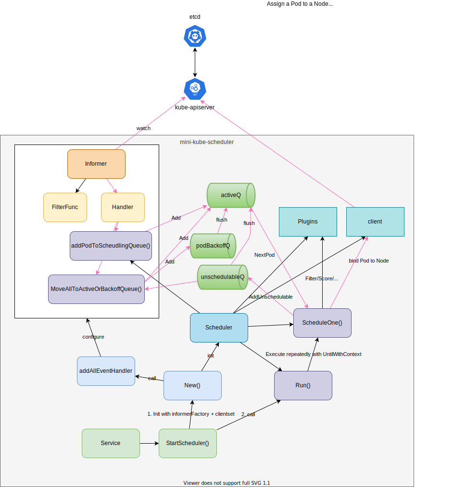

# Mini Kube Scheduler

What this repo does are:
- Study kubernetes scheduler following [自作して学ぶKubernetes Scheduler](https://engineering.mercari.com/blog/entry/20211220-create-your-kube-scheduler/) with https://github.com/sanposhiho/mini-kube-scheduler.
- Simplify the original repo https://github.com/sanposhiho/mini-kube-scheduler

## Versions

- Go: 1.17
- Kubernetes: [1.23.4](https://github.com/kubernetes/kubernetes/releases/tag/v1.23.4)

## Components

- `Scheduler`
    - `SchedulingQueue`
    - `client`
- `Informer` with `Handler` (`Scheduler.addPodToSchedulingQueue()`) + `FilterFunc`
- `Service`:
    - Initialize Scheduler and set the event handler for informer with `New()`
    - Call `Scheduler.Run()` to start `Scheduler`.

Diagram:



Files:
1. `hack`: Shell scripts
    1. `etcd.sh`: Functions to start/stop/cleanup etcd.
    1. `openapi.sh`: Generate `zz_generated.openapi.go` for `kube-apiserver`.
    1. `run.sh`: Start etcd and run the scheduler.
1. `k8sapiserver`: Dependency to run a scheduler.
1. `minisched`: Implementation of mini-kube-scheduler.
1. `sched.go`: Run dependency (`apiserver`) and the scheduler within a scenario (create nodes and a pod).
1. `scheduler`: Scheduler service to manage `minisched`.

## Steps

1. [Initial Random Scheduler](https://github.com/nakamasato/mini-kube-scheduler/blob/01-initial-random-scheduler/01-initial-random-scheduler.md)

## Tips

### kube-apiserver

Use https://github.com/kubernetes/kubernetes to generate [k8sapiserver/openapizz_generated.openapi.go](k8sapiserver/openapizz_generated.openapi.go).

### Go module error

If you get [unknown revision v0.0.0' errors, seemingly due to 'require k8s.io/foo v0.0.0' #79384](https://github.com/kubernetes/kubernetes/issues/79384#issuecomment-521493597), run the command:

```
./update_go_mod.sh <k8s_version> # e.g. 1.23.4
```

### Plugins

You can use [default plugins](https://kubernetes.io/docs/reference/scheduling/config/#scheduling-plugins) or implement your own plugins

## References
1. kubernetes.io/docs
    1. https://kubernetes.io/docs/concepts/scheduling-eviction/scheduling-framework
    1. https://kubernetes.io/docs/reference/scheduling/config
1. github.com
    1. https://github.com/sanposhiho/mini-kube-scheduler
    1. https://github.com/draios/kubernetes-scheduler
    1. https://github.com/kubernetes/enhancements/tree/master/keps/sig-scheduling/624-scheduling-framework
    1. https://github.com/kubernetes-sigs/kube-scheduler-simulator
    1. https://github.com/kubernetes-sigs/scheduler-plugins
1. Others
    1. [自作して学ぶKubernetes Scheduler (mercari engineering)](https://engineering.mercari.com/blog/entry/20211220-create-your-kube-scheduler/)
    1. [自作して学ぶKubernetes scheduler入門 (CloudNative Days 2021)](https://event.cloudnativedays.jp/cndt2021/talks/1184)
    1. [Writing custom Kubernetes schedulers](https://banzaicloud.com/blog/k8s-custom-scheduler/)
    1. [Kubernetes Scheduler 自作入門](https://qiita.com/ozota/items/28f6686029865e8df4fe)
    1. [Building a Kubernetes Scheduler using Custom Metrics - Mateo Burillo, Sysdig (YouTube)](https://www.youtube.com/watch?v=4TaHQgG9wEg)
    1. ['unknown revision v0.0.0' errors, seemingly due to 'require k8s.io/foo v0.0.0' #79384](https://github.com/kubernetes/kubernetes/issues/79384#issuecomment-521493597)
